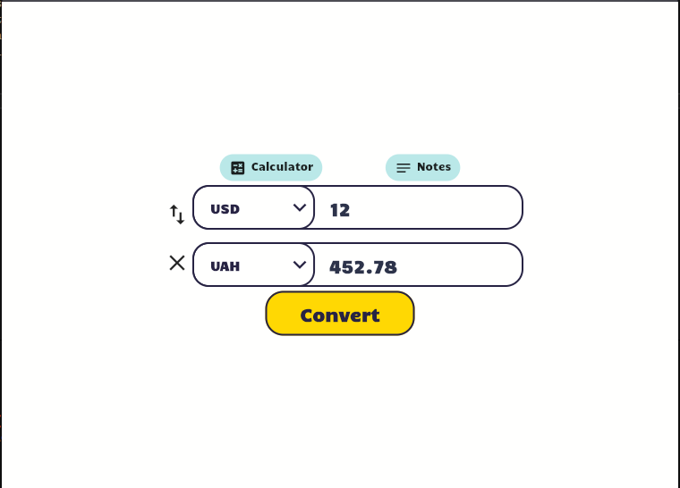
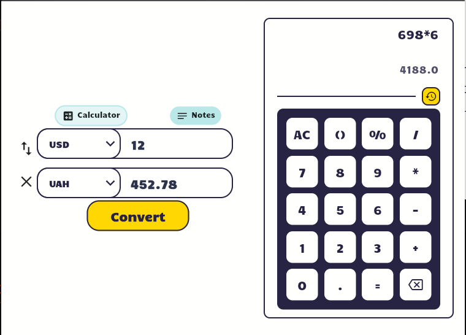
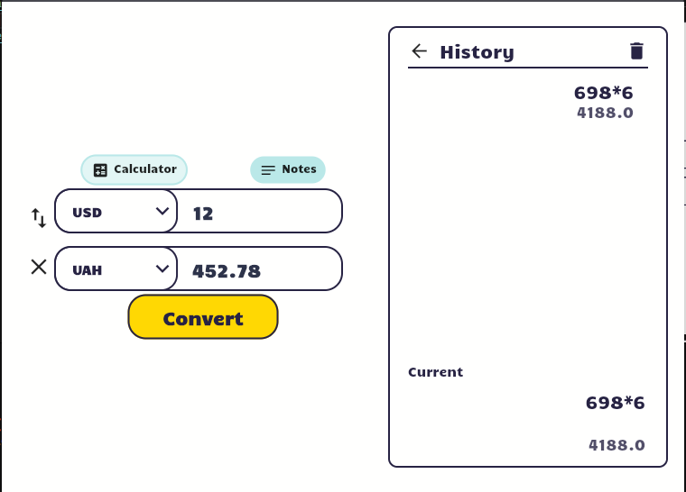
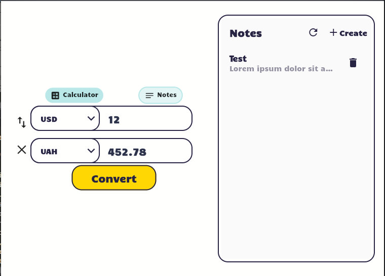
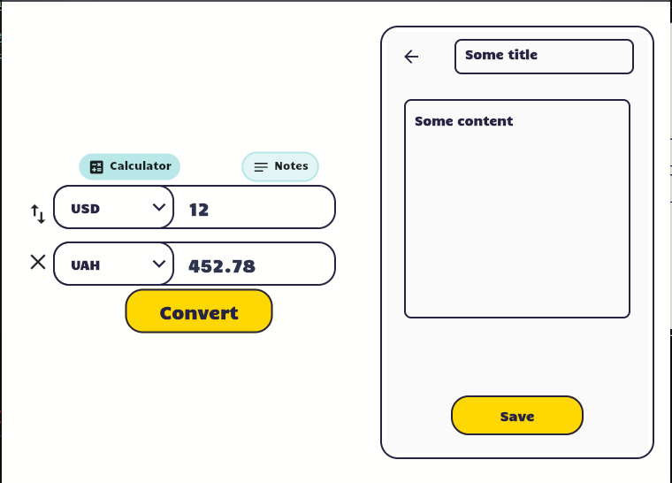
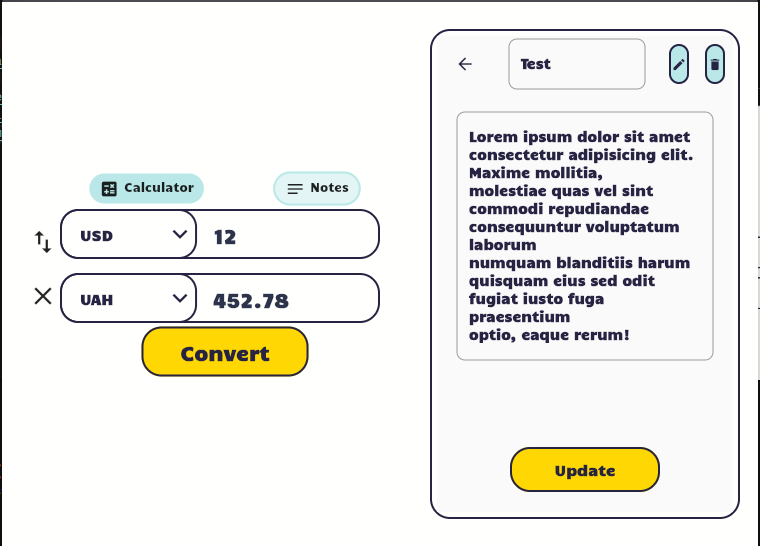
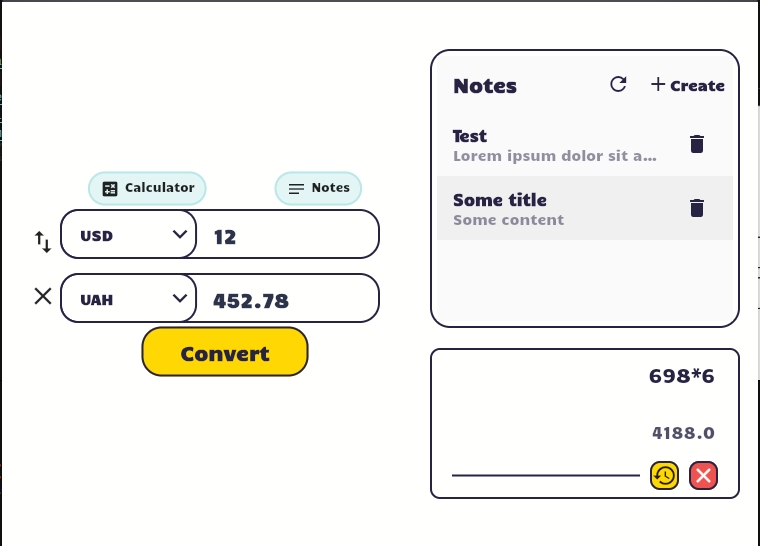
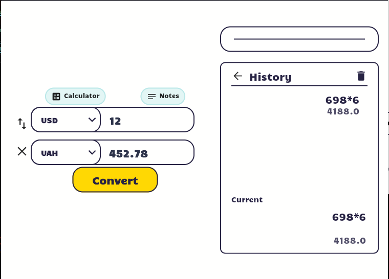

# ValutaVerse

ValutaVerse is a simple desktop application that allows users to convert between different currencies, take notes, and make simple calculations. The application is built using Dart with Flutter framework. The application uses the free [currency-api](https://github.com/fawazahmed0/currency-api) to get the latest exchange rates.

> Before you start reading about the project, I would like to mention that this project is a part of my learning process. I am still learning and if some parts of the code are not perfect, I would appreciate any feedback. Thank you! For now I satisfied with the result, as I spent only 7 days to build this application.

## Features
- Convert between different currencies
- Take notes
- View existing notes
- Edit existing notes
- Delete existing notes
- Make simple calculations
- View history of calculations

## Screenshots

| Currency Converter                                   | Calculator                                      | Calculator History                                             |
| ---------------------------------------------------- | ----------------------------------------------- | -------------------------------------------------------------- |
|  |  |  |

| Notes                                 | Create Note                                      | Edit/View Note                                          |
| ------------------------------------- | ------------------------------------------------ | ------------------------------------------------------- |
|  |  |  |

| Both Modules Open                                             | Calculations History When Both Modules Open                                                                  |
| ------------------------------------------------------------- | ------------------------------------------------------------------------------------------------------------ |
|  |  |


## Getting Started

For run this project you need to have Flutter installed on your machine. If you don't have Flutter installed, you can follow the instructions [here](https://flutter.dev/docs/get-started/install).

1. Clone the repository
```bash
git clone --depth 1 https://github.com/hikionori/currency_exchange
```

2. Navigate to the project directory
```bash
cd currency_exchange
```

3. Build project 
```bash
flutter build <windows/linux/macos>
```

3. Or you can run the project directly
```bash
flutter run --release
```

4. If you build the project, you can find the executable in the build folder
```
currency_exchange/build/<windows/linux/macos>/release/bundle
```

5. Enjoy the application!

## License
This project is licensed under the MIT License - see the [LICENSE](LICENSE) file for details.